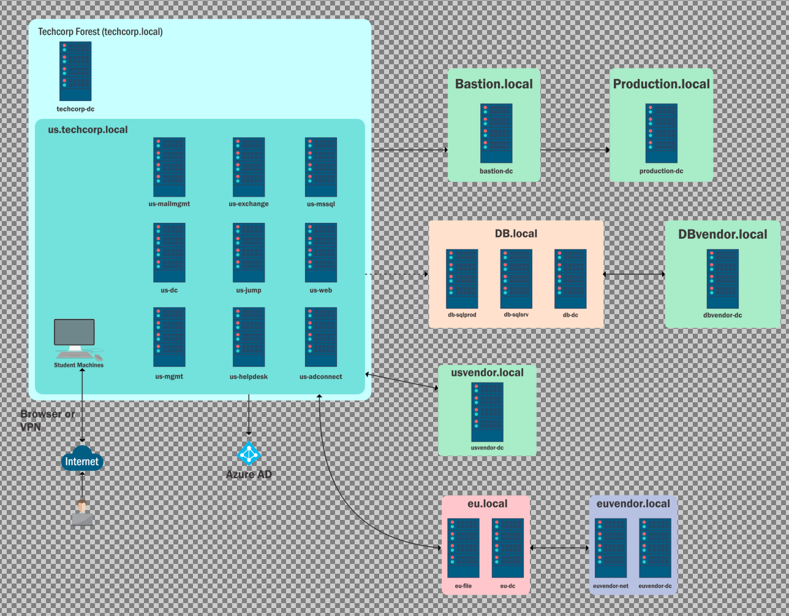
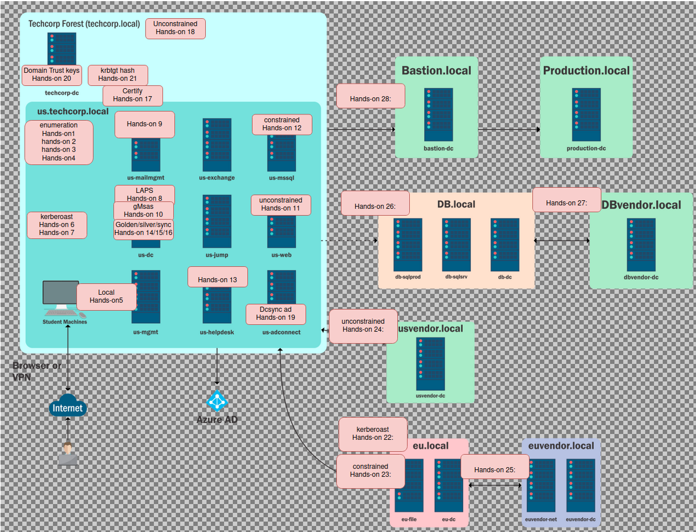

# Certification LAB

## Enumeration:
[Enumeration](enumeration.md)

## Techniques
[Techniques](techniques.md)

## Content by lab:
  
  1. [Content Lab1](content_lab1.md)
  2. [Content Lab2](content_lab2.md)
  3. [Content Lab3](content_lab3.md)
  4. [Content Lab4](content_lab4.md)
  5. [Content Lab5](content_lab5.md)
  6. [Content Lab6](content_lab6.md)
  7. [Content Lab7](content_lab7.md)
  8. [Content Lab8](content_lab8.md)
  9. [Content Lab9](content_lab9.md)
  10. [Content Lab10](content_lab10.md)
  11. [Content Lab11](content_lab11.md)
  12. [Content Lab12](content_lab12.md)
  13. [Content Lab13](content_lab13.md)
  14. [Content Lab14](content_lab14.md)
  15. [Content Lab15](content_lab15.md)
  16. [Content Lab16](content_lab16.md)
  17. [Content Lab17](content_lab17.md)
  18. [Content Lab18](content_lab18.md)
  19. [Content Lab19](content_lab19.md)
  20. [Content Lab20](content_lab20.md)
  21. [Content Lab21](content_lab21.md)
  22. [Content Lab22](content_lab22.md)
  23. [Content Lab23](content_lab23.md)
  24. [Content Lab24](content_lab24.md)
  25. [Content Lab25](content_lab25.md)
  26. [Content Lab26](content_lab26.md)
  27. [Content Lab27](content_lab27.md)
  28. [Content Lab28](content_lab28.md)

## Users and Computers by lab:

| Resource | Lab1  | Lab2 | Lab3 |Lab4 | Lab5 | Lab 6 | Lab7 | Lab8 | Lab9 | Lab10 | Lab11 | Lab12 | Lab13 | Lab14 | Lab15 | Lab16 | Lab17 | Lab18 | Lab19 | Lab20 | Lab21 | Lab22 | Lab23 | Lab 24 | Lab 25 | Lab26 | Lab 27 | Lab 28 |
| ------------- | ------------- | ------------- | ------------- | ------------- | ------------- | ------------- | ------------- | ------------- | ------------- | ------------- | ------------- | ------------- | ------------- | ------------- | ------------- | ------------- | ------------- | ------------- | ------------- | ------------- | ------------- | ------------- | ------------- | ------------- | ------------- | ------------- | ------------- | ------------- |
| Computers | student17$ | student17$ | student17$ | student17$ | us-mgmt |  | kerberoast | kerberoast | us-mailmgmt | us-mailmgmt | us-jump | us-web | US-MSSQL/US-MGMT/US-DC | ------------- | ------------- | ------------- | ------------- | ------------- | ------------- | ------------- | ------------- | ------------- | ------------- | ------------- | ------------- | ------------- | ------------- |
| Users | studentuser17 | studentuser17 | studentuser17 | student17\Administrator | us-mgmt\Administrator | serviceaccount | support17user | us-mailmgmt\Administrator | provisioningsvc | jumpone/pawadmin/webmaster/appsvc | webmaster/us\krbtgt/us\Administrator | us\administrator | ------------- | ------------- | ------------- | ------------- | ------------- | ------------- | ------------- | ------------- | ------------- | ------------- | ------------- | ------------- | ------------- | ------------- | ------------- |

## Hands-On Labs solution:

  1. [Hands-on 1](hands_on_1.md)
  2. [Hands-on 2](hands_on_2.md)
  3. [Hands-on 3](hands_on_3.md)
  4. [Hands-on 4](hands_on_4.md)
  5. [Hands-on 5](hands_on_5.md)
  6. [Hands-on 6](hands_on_6.md)
  7. [Hands-on 7](hands_on_7.md)
  8. [Hands-on 8](hands_on_8.md)
  9. [Hands-on 9](hands_on_9.md)
  10. [Hands-on 10](hands_on_10.md)
  11. [Hands-on 11](hands_on_11.md)
  12. [Hands-on 12](hands_on_12.md)
  13. [Hands-on 13](hands_on_13.md)
  14. [Hands-on 14](hands_on_14.md)
  15. [Hands-on 15](hands_on_15.md)
  16. [Hands-on 16](hands_on_16.md)
  17. [Hands-on 17](hands_on_17.md)
  18. [Hands-on 18](hands_on_18.md)
  19. [Hands-on 19](hands_on_19.md)
  20. [Hands-on 20](hands_on_20.md)
  21. [Hands-on 21](hands_on_21.md)
  22. [Hands-on 22](hands_on_22.md)
  23. [Hands-on 23](hands_on_23.md)
  24. [Hands-on 24](hands_on_24.md)
  25. [Hands-on 25](hands_on_25.md)
  26. [Hands-on 26](hands_on_26.md)
  27. [Hands-on 27](hands_on_27.md)
  28. [Hands-on 28](hands_on_28.md)

