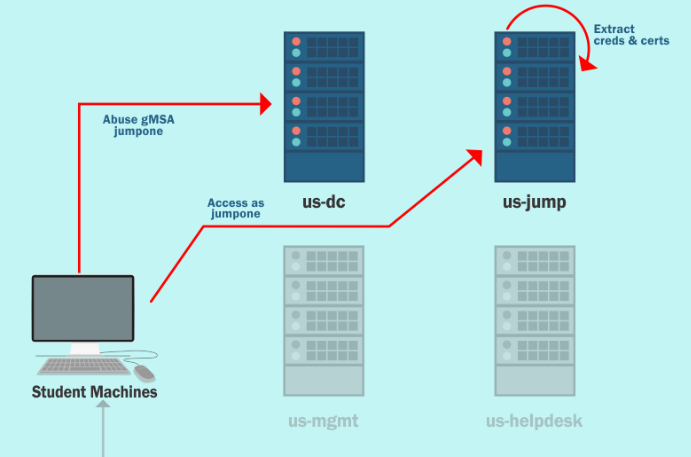

# Content Lab10:

| computer | user |
| ------- | ------ |
| ActiveDirectory | jumpone |
| US_JUMP | Administrator |
| US-JUMP | pawadmin |
| US_JUMP | US-JUMP$ |
| US-JUMP | webmaster |
| US-JUMP | appsvc |





In this lab the attacker should undertand and abusse gMSAs on windows Active directory:

```
  - Enumerate gMSAs in the us.techcorp.local domain.
  - Enumerate the principals that can read passwords from any gMSAs.
  - Compromise one such principal and retrieve the password from a gMSA.
  - Find if the gMSA has high privileges on any machine and extract credentials from that machine.
```

GMSAs:

```
  - A group Managed Service Account (gMSA) provides automatic password management, SPN management and delegated administration for service accounts across multiple servers.
  - Use of gMSA is recomended to protect from kerberoas type attacks
  - A 256 bytes random password is generated and is rotated every 30 days.
  - When an authorized user reads the attribute 'msds-ManagedPassword' the gMSA password is computed.
  - Only explicit specified principals can read the password blob. Even the DOmain Admins can't read it by default.
```

Golden gMSA

```
  - gMSA password is calculated by levearing the secret stored in KDS root key object.
  - We need following attributes of the KDS root key to compute the Group key Envelope (GKE)
      - cn
      - msKds-SecretAgreementParam
      - msKds-RootKeyData
      - msKds-KDFParam
      - msKds-KDFAlgorithmID
      - msKds-CreateTime
      - msKds-UserStratTime
      - msKds-Version
      - msKds-DomainID
      - msKds-PrivateKeyLength
      - msKds-PublicKeyLength
      - msKds-SecretAgreementAlgorithmID
```
```
  - Once we compute the GKE for the associated KDS root key we can generate the password offline.
  - Only privilege accounts such as Domain Admins, Enterprise Admins or SYSTEM can retrive the KDS root key.
  - Once the KDS root key is compromised we can't protect the associated gMSAs accounts.
  - Golden gMSA can be used to retrive the information of gMSA account, KDS root key and generate the password offline.
```
