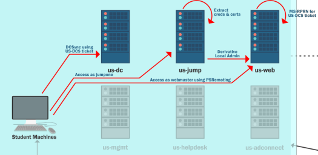

# Content Lab11:

| computer | user |
| ------- | ------ |
| xxxx | xxxx |
| xxxx | xxxxx |



The attacker should abusse and understand Kerberos Delegation (Unconstrained):
```
  - Find a server in US domain where Unconstrained Delegation is enabled.
  - Compromise that server and get Domain Admin privileges.
```


