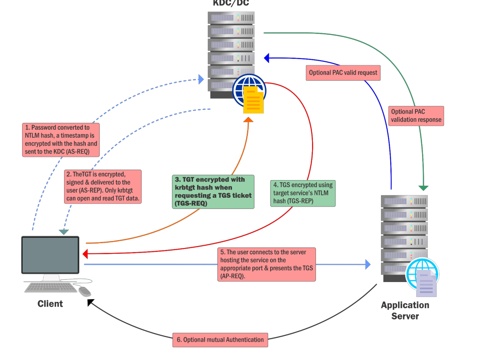

# Content Lab14:

## Golden ticket parameters table:

| Parameter  | Description |
| ------------- | ------------- |
| kerberos::golden  | Name of the module  |
| /User:Administrator  | Username for wich the TGT is generated  |
| /domain:us.techcorp.local | Domain FQDN|
| /sid:| SID of the domain|
| /krbtgt:| NTLM(RC4) hash of the krbtgt account. Use /aes256 os /aes128 for using AES keys|
| /id:500 /groups:512 | Optional USER RID (default 500) and group (default 512 513 520 518 519)|
| /ptt or /ticket | Inject ticket on current sesison process or save the ticket to file for later use |
| /startoffset:0 | Optional when ticket is available  (default 0)|
| /endin:600 | Optional ticket lifetime (default 10 years)|
| /renewmax:10080| Optional ticket lifetime with renewval (default 10 years)|

