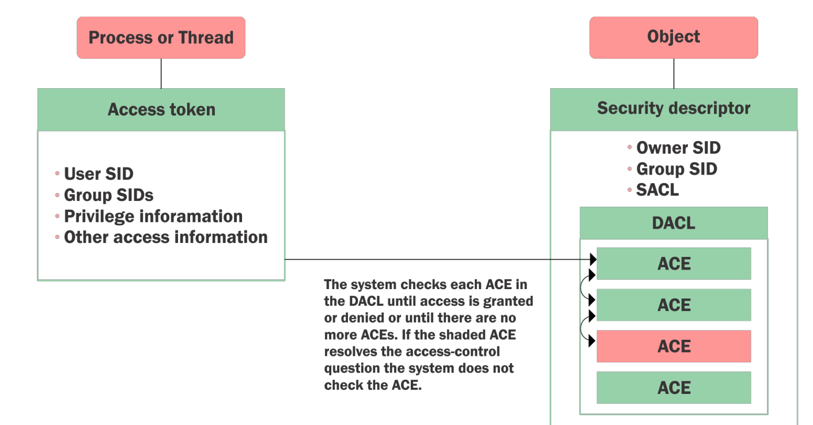

# Content Lab2:

On this lab the attacker should enumerate the us.techcorp.local domain.


The enumeration objects:

```
  - Restricted Groups from GPO
  - Membership of the restricted groups
  - List all the OUs
  - List all the computers in the Students OU.
  - List the GPOs
  - Enumerate GPO applied on the Students OU.
```


Access Control Model
```
Enables control on the ability of a process to access objects and other resources in the active directory:
  - Access Tokens (security context of a process - identity and privs of user)
  - Security descriptors (SID of the owner, Discretionary ACL (DACL) and system ACL (SACL))
```
Access control list (ACL)
```
It is a list of Access Control Entries (ACE) - ACE corresponds to individual permission or audit access.
Two types:
  - DACL - Defines the permissions trustees (a user or group) have on an object.
  - SACL - Logs success and failure audit messages when an object is accessed.
```
The tools:

```
The tools required for the lab:

  - Invishell
  - Active Directory module
  - PowerView module
  - BloodHound ¿?
  
```
