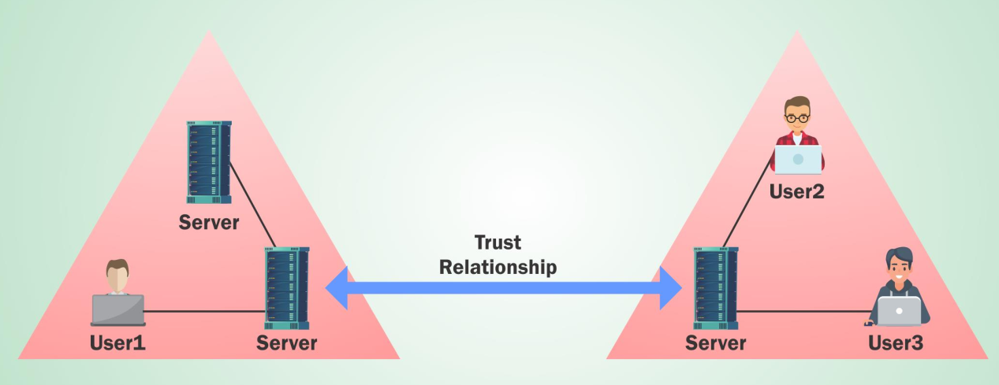

# Content Lab4:

On this lab the attacker should enumerate the us.techcorp.local domain.


The enumeration objects:

```
  - Enumerate all domains in the techcorp.local forest.
  - Map the trusts of the us.techcorp.local domain.
  - Map External trusts in techcorp.local forest.
  - Identify external trusts of us domain. Can you enumerate trusts for a trusting forest?

```
Trusted relationships:

```
One-way trust relationship
```


```
Two-way trust relationship
```


The tools:

```
The tools required for the lab:

  - Invishell
  - Active Directory module
  - PowerView module
  - BloodHound ¿?
  
```
