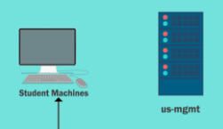
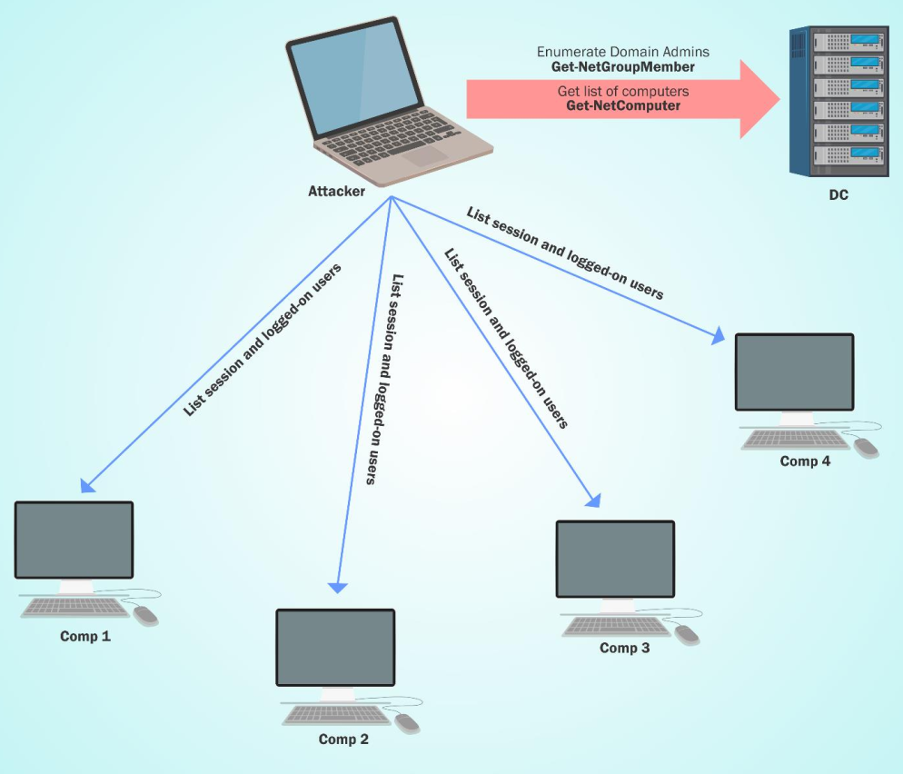

# Content Lab5:

 

| computer | user |
| ------- | ------ |
| student17$ | studentuser17 |
| student17$ | Administrator |
| US-MGMT | studentuser17 |

```
  - Exploit a service on studentx and elevate privileges to local administrator.
  - Identify a machine in the domain where studentuserx has local administrative access due to group membership.
```

The first step is escalate privileges on local machine:
```
  - Review the services and abusse privileges with powerup
```

The second step is escalate evaluate all ACLs on the for the studentuser17 :
```
 - Include the userstudent17 on machineAdmins groups
 - The machineadmins group allow the users access to US-MGMT such administrator
```





