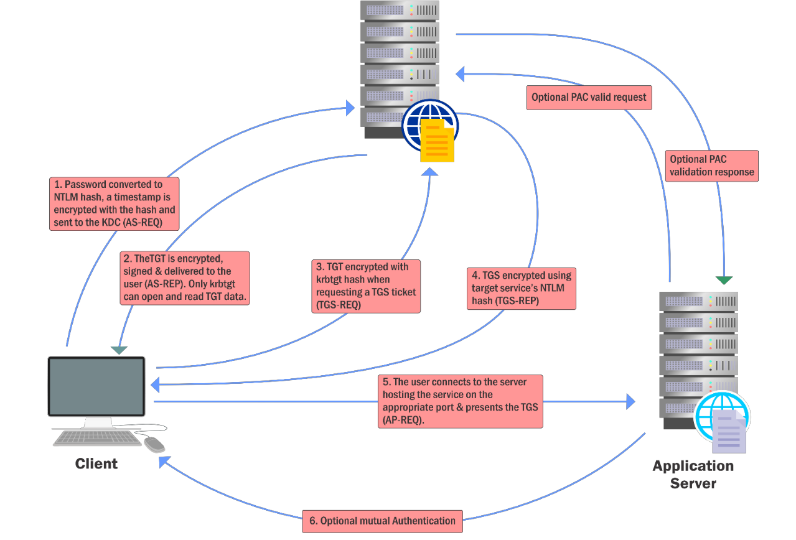
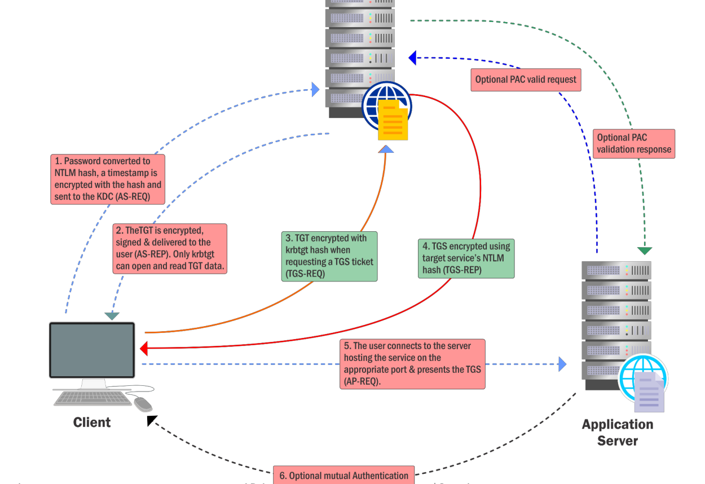

# Content Lab6:

On this lab the studentuser should enumerate directly Active Directory kerberoast user objects:

```
Using the Kerberoast attack, get the clear-text password for an account in us.techcorp.local
domain.

```
| computer | user |
| ------- | ------ |
| ActiveDiretory | serviceaccount |
| ActiveDiretory | appsvc |


Kerberos TGT request flow:



Kerberoas attack flow:



