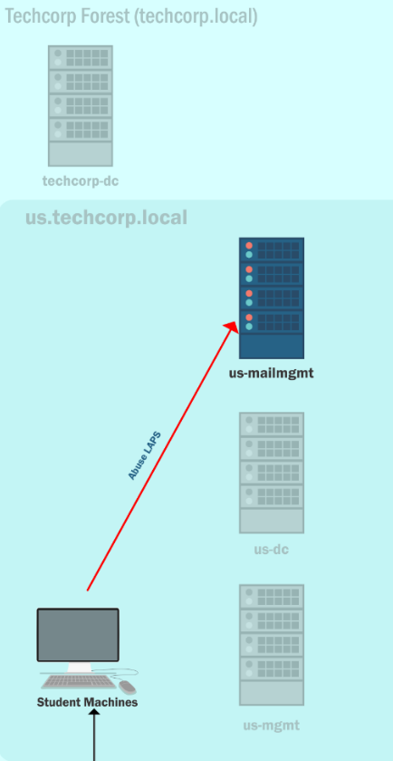

# Content Lab9:

| computer | user |
| ------- | ------ |
| US-MAILMGMT | Administrator |
| US-MAILMGMT | provisioningsvc |
| US-MAILMGMT | US-MAILMGMT$ |



```
Extract credentials of interactive logon sessions and service accounts from us-mailmgmt.
```
  1. Abusse permissions of stracted credentials for LAPS.
  2. Use the Loader.exe to execute remote binary using network (fileless) and stract keys for the target server.

